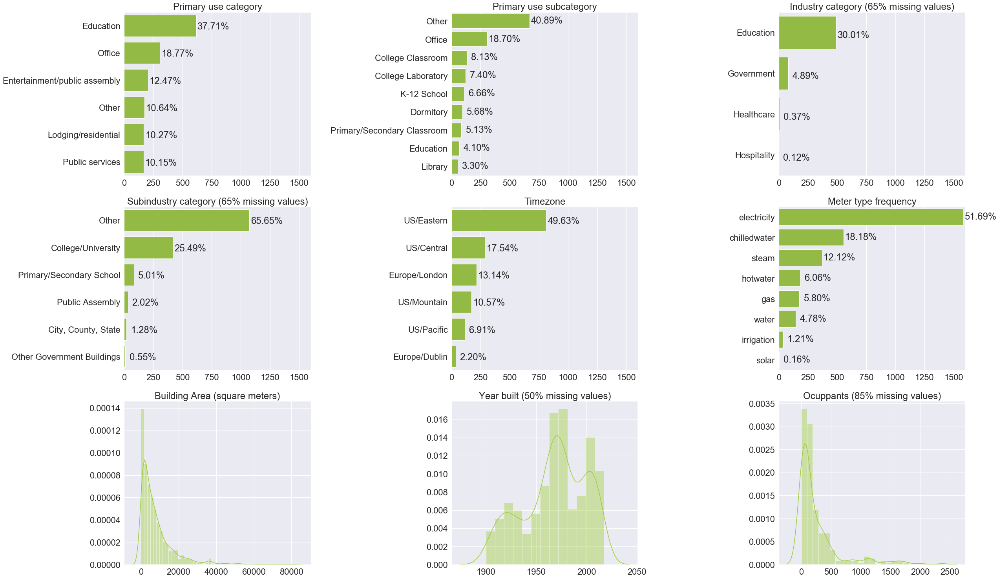

# Building Data Genome 2.0 Data-Set
## Data-set description
BDG 2.0 is an open data set made up of 3,053 energy meters from 1,636 buildings. The time range of the times-series data is the two full years (2016 and 2017) and the frequency is hourly measurements of electricity, heating and cooling water, steam, and irrigation meters. A subset of the data was used in the [Great Energy Predictor III (GEPIII) competition hosted by the ASHRAE organization in late 2019](https://www.kaggle.com/c/ashrae-energy-prediction). The GEPIII sub-set includes hourly data from 2,380 meters from 1,449 buildings that were used in a machine learning competition for long-term prediction with an application to measurement and verification in the building energy analysis domain. This data set can be used to benchmark various statistical learning algorithms and other data science techniques. It can also be used simply as a teaching or learning tool to practice dealing with measured performance data from large numbers of non-residential buildings. The charts below illustrate the breakdown of the buildings according to primary use category and subcategory, industry and subindustry, timezone and meter type.<br>



## Getting Started
We recommend you download the [Anaconda Python Distribution](https://www.continuum.io/downloads) and use Jupyter to get an understanding of the data.
- Temporal meters data are found in `/data/meters/`
- Metadata is found in `data/metadata/`
- To join all meters raw data into one dataset follow [this](/notebooks/00_All-meters-dataset.ipynb) notebook

Example notebooks are found in `/notebooks/` -- a few good overview examples:
- [Exploratory Data Analysis of metadata](notebooks/01_EDA-metadata.ipynb)
- [Exploratory Data Analysis of weather](notebooks/02_EDA-weather.ipynb)
- [Exploratory Data Analysis of meter reading](notebooks/03_EDA-meter-reading.ipynb)

## Detailed Documentation
The detailed documentation of how this data set was created can be found in the [repository's wiki](https://github.com/buds-lab/building-data-genome-project-2/wiki) and in the following publication:

### Citation of BDG 2.0 Data-Set
* (Publication)
* (ResearchGate)
* (Bibtex)

# Publications or Projects that use BDG 2.0 data-set
Please update this list if you add notebooks or R-Markdown files to the ``notebook`` folder. Naming convention is a number (for ordering), the creator's initials, and a short `-` delimited description, e.g. `1.0-jqp-initial-data-exploration`.

- (publication here)

## Repository structure
```
building-data-genome-project-2
├─ README.md              <- BDG 2.0 README for developers using this data-set
└─ data
|   ├─metadata            <- buildings metadata
|   ├─ weather            <- weather data
|   └─ meters
|       └─ raw            <- all meter reading datasets, one file for each kind of meter
├─ notebooks              <- Jupyter notebooks, named after the naming convention
└─ figures                <- figures created during exploration of BDG 2.0 Data-set
```


